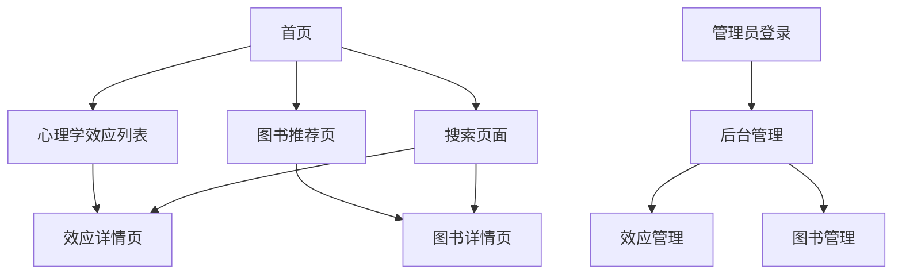

## 1. 产品概述
这是一个专注于心理学效应和精神分析知识科普的网站，通过精美的可视化设计和漫画风格的艺术表现，让复杂的心理学概念变得生动易懂。网站为心理学爱好者、学生和普通用户提供高质量的心理学知识内容。

目标用户包括心理学学习者、教育工作者、对心理学感兴趣的普通用户，为他们提供专业而易懂的心理学知识科普服务。

## 2. 核心功能

### 2.1 用户角色
| 角色 | 注册方式 | 核心权限 |
|------|----------|----------|
| 普通访客 | 无需注册 | 浏览心理学效应、查看图书推荐、搜索内容 |
| 管理员 | 预置账号密码 | 登录后台、管理心理学效应内容、管理图书信息 |

### 2.2 功能模块
网站包含以下核心页面：
1. **首页**：每日展示一个心理学效应、艺术化背景、导航入口。
2. **搜索页面**：关键词搜索、搜索结果展示、相关推荐。
3. **心理学效应列表页**：效应卡片展示、分类筛选、搜索功能。
4. **心理学效应详情页**：详细介绍、实验过程、应用场景、相关图片视频。
5. **图书推荐页**：书籍卡片展示、搜索栏、分类浏览、详情查看。
6. **管理员登录页**：安全登录入口。
7. **后台管理页**：内容管理、效应编辑、图书管理、媒体上传。

### 2.3 页面详情
| 页面名称 | 模块名称 | 功能描述 |
|----------|----------|----------|
| 首页 | 每日效应展示 | 每天展示一个精选心理学效应，包含名称、简介、精美配图，营造专注学习氛围 |
| 首页 | 导航入口 | 提供心理学效应、图书推荐、搜索页面等主要功能入口 |
| 心理学效应列表 | 效应卡片 | 以卡片形式展示效应名称、提出者、简短描述，支持点击查看详情 |
| 心理学效应列表 | 搜索筛选 | 支持按关键词搜索、按类别筛选效应 |
| 心理学效应详情 | 详细介绍 | 展示效应的完整定义、发现历程、实验过程、实际应用 |
| 心理学效应详情 | 多媒体展示 | 展示相关图片、实验视频、动画解释 |
| 图书推荐页 | 搜索栏 | 在页面顶部提供搜索框，支持按书名、作者、关键词搜索图书 |
| 图书推荐页 | 书籍展示 | 以卡片形式展示书籍封面、标题、作者、评分信息 |
| 图书推荐页 | 详情查看 | 点击书籍查看完整信息，包括ISBN、出版社、出版日期、简介 |
| 搜索页面 | 搜索框 | 提供 prominently 的搜索输入框，支持关键词联想 |
| 搜索页面 | 搜索结果 | 展示心理学效应和图书的搜索结果，支持分类筛选 |
| 搜索页面 | 相关推荐 | 基于搜索内容推荐相关的心理学效应和图书 |
| 管理员登录 | 安全登录 | 输入账号密码进行身份验证 |
| 后台管理 | 效应管理 | 添加、编辑、删除心理学效应信息 |
| 后台管理 | 图书管理 | 添加、编辑、删除图书推荐信息 |
| 后台管理 | 媒体管理 | 上传和管理图片、视频等多媒体资源 |

## 3. 核心流程

### 普通用户流程
用户访问首页 → 查看每日心理学效应 → 可通过导航进入搜索页面 → 输入关键词搜索 → 查看搜索结果 → 点击具体效应或图书了解详情 → 可继续浏览其他内容

用户也可直接从首页导航到心理学效应列表或图书推荐页 → 使用页面内搜索功能查找内容 → 查看详情

### 管理员流程
管理员访问登录页 → 输入账号密码 → 进入后台管理 → 选择管理心理学效应或图书 → 进行增删改查操作 → 保存更新

## 4. 用户界面设计

### 4.1 设计风格
- **主色调**：深紫色(#4A148C)配金色(#FFD700)，营造神秘学术感
- **辅助色**：暖灰色(#F5F5F5)、深空蓝(#1A237E)
- **按钮样式**：圆角矩形，悬停时有轻微阴影和颜色渐变
- **字体选择**：标题使用思源黑体，正文字体使用微软雅黑，字号14-16px
- **布局风格**：卡片式布局，配合漫画风格的分割线和装饰元素
- **图标风格**：手绘风格图标，线条简洁，符合心理学主题

### 4.2 页面设计概览
| 页面名称 | 模块名称 | UI元素 |
|----------|----------|--------|
| 首页 | 艺术展示区 | 全屏心理学主题插画，使用渐变背景，中央放置动态心理学符号，配合粒子动画效果 |
| 心理学效应列表 | 效应卡片 | 采用悬浮卡片设计，每张卡片有轻微阴影，悬停时上浮效果，使用圆角边框 |
| 心理学效应详情 | 内容展示 | 左侧图片/视频展示，右侧文字说明，采用分栏布局，重要概念用高亮色标注 |
| 图书推荐页 | 搜索栏 | 页面顶部居中位置，采用圆角输入框，配合搜索图标，支持实时搜索建议 |
| 图书推荐页 | 书籍网格 | 采用网格布局展示书籍，每本书有精美的封面展示，悬停时显示详细信息 |
| 搜索页面 | 搜索区域 | 页面顶部大标题配搜索框，采用卡片式设计，背景使用渐变色彩 |
| 搜索页面 | 结果展示 | 采用标签页分别展示效应和图书结果，支持排序和筛选 |
| 后台管理 | 管理面板 | 简洁的表格展示，操作按钮清晰明了，表单采用分组布局 |

### 4.3 响应式设计
采用桌面端优先设计，确保在大屏幕上展现最佳的视觉效果。移动端适配采用自适应布局，保持核心功能完整，优化触摸交互体验。图片和文字在小屏幕上自动调整大小，确保可读性。

### 4.4 视觉特效指导
- 页面切换采用平滑的淡入淡出效果
- 卡片悬停时有微妙的阴影变化和轻微上浮动画
- 重要内容区域使用手绘风格的边框装饰
- 背景可添加微妙的心理学图案纹理
- 交互动画保持简洁优雅，避免过度炫技