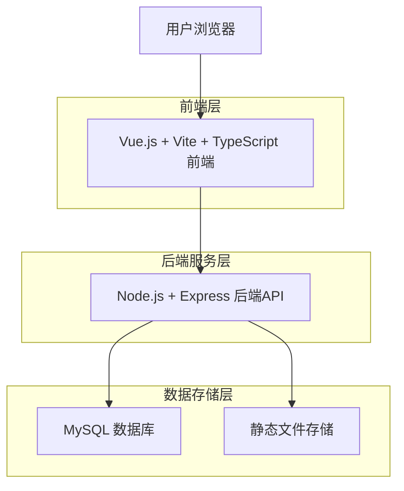
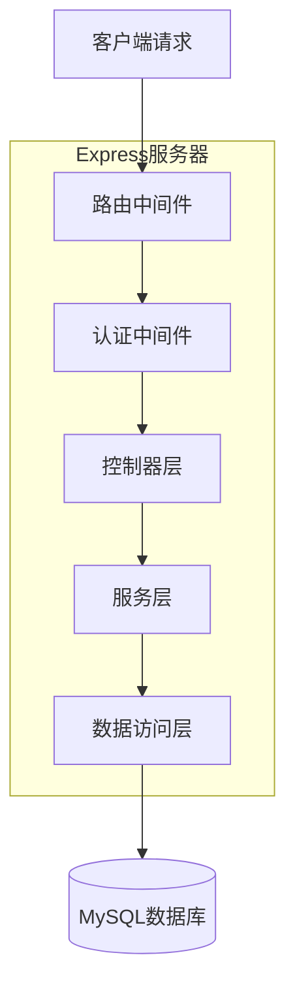
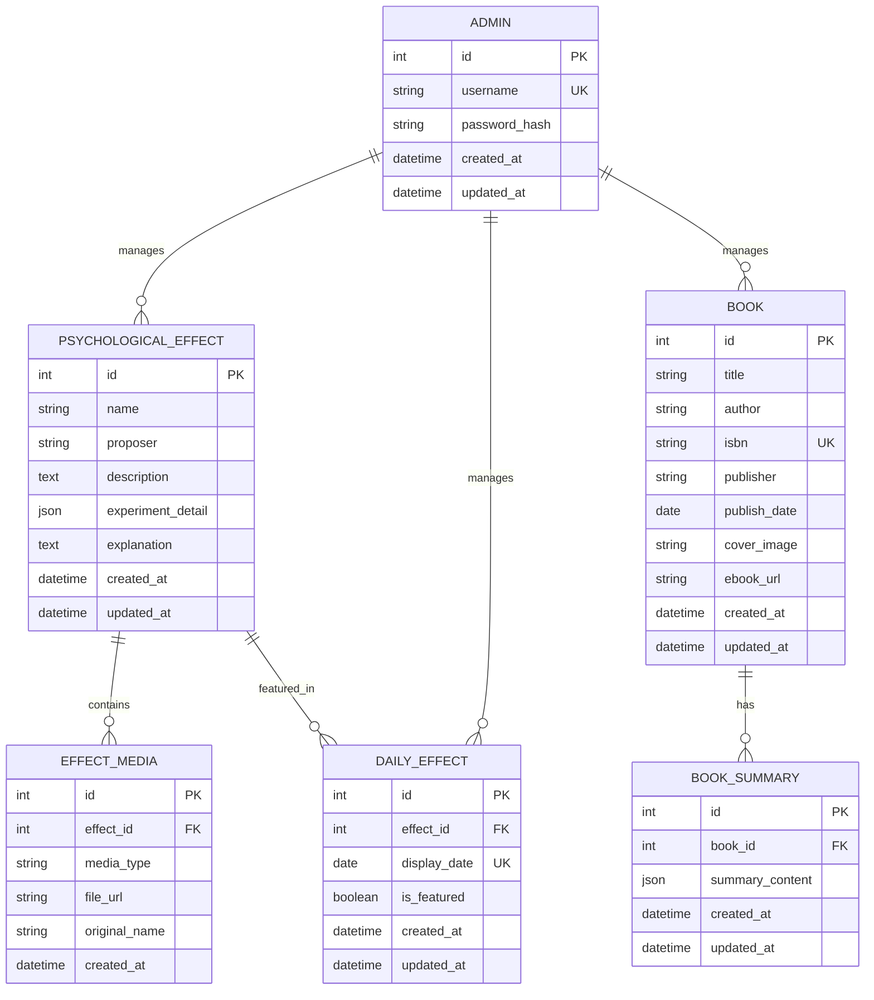

## 1. 架构设计



## 2. 技术描述

- **前端**: Vue@3 + Vite@4 + TypeScript@5 + Element Plus@2
- **初始化工具**: vite-init
- **后端**: Node.js@18 + Express@4 + TypeScript@5
- **数据库**: MySQL@8
- **其他依赖**: 
  - 前端状态管理：Pinia@2
  - HTTP客户端：Axios@1
  - 文件上传：Multer@2
  - 密码加密：bcrypt@5
  - JWT认证：jsonwebtoken@9

## 3. 路由定义

| 路由 | 用途 |
|------|------|
| / | 首页，每日展示一个心理学效应 |
| /search | 搜索页面，支持关键词搜索效应和图书 |
| /effects | 心理学效应列表页面 |
| /effects/:id | 心理学效应详情页面 |
| /books | 图书推荐列表页面 |
| /books/:id | 图书详情页面 |
| /admin/login | 管理员登录页面 |
| /admin/dashboard | 后台管理首页 |
| /admin/effects | 心理学效应管理页面 |
| /admin/books | 图书管理页面 |
| /admin/media | 媒体文件管理页面 |

## 4. API定义

### 4.1 认证相关API

**管理员登录**
```
POST /api/auth/login
```

请求参数：
| 参数名 | 参数类型 | 是否必需 | 描述 |
|--------|----------|----------|------|
| username | string | 是 | 管理员账号 |
| password | string | 是 | 管理员密码 |

响应参数：
| 参数名 | 参数类型 | 描述 |
|--------|----------|------|
| token | string | JWT认证令牌 |
| user | object | 用户信息 |

### 4.2 心理学效应API

**获取每日效应**
```
GET /api/daily-effect
```

响应参数：
| 参数名 | 参数类型 | 描述 |
|--------|----------|------|
| effect | object | 当日心理学效应详情 |
| date | string | 日期 |

**搜索功能**
```
GET /api/search
```

查询参数：
| 参数名 | 参数类型 | 是否必需 | 描述 |
|--------|----------|----------|------|
| keyword | string | 是 | 搜索关键词 |
| type | string | 否 | 搜索类型：'effects'、'books'、'all'，默认'all' |
| page | number | 否 | 页码，默认1 |
| limit | number | 否 | 每页数量，默认20 |

**获取效应列表**
```
GET /api/effects
```

查询参数：
| 参数名 | 参数类型 | 是否必需 | 描述 |
|--------|----------|----------|------|
| page | number | 否 | 页码，默认1 |
| limit | number | 否 | 每页数量，默认20 |
| keyword | string | 否 | 搜索关键词 |

**获取效应详情**
```
GET /api/effects/:id
```

**创建效应**
```
POST /api/effects
```

请求体：
| 参数名 | 参数类型 | 是否必需 | 描述 |
|--------|----------|----------|------|
| name | string | 是 | 效应名称 |
| proposer | string | 是 | 提出者 |
| description | string | 是 | 效应描述 |
| experiment | object | 是 | 实验详情JSON |
| explanation | string | 是 | 效应解释 |
| images | array | 否 | 图片URL数组 |
| videos | array | 否 | 视频URL数组 |

### 4.3 图书推荐API

**获取图书列表**
```
GET /api/books
```

查询参数：
| 参数名 | 参数类型 | 是否必需 | 描述 |
|--------|----------|----------|------|
| page | number | 否 | 页码，默认1 |
| limit | number | 否 | 每页数量，默认20 |
| keyword | string | 否 | 搜索关键词（书名、作者、ISBN） |
| category | string | 否 | 图书分类 |

**获取图书详情**
```
GET /api/books/:id
```

**创建图书**
```
POST /api/books
```

请求体：
| 参数名 | 参数类型 | 是否必需 | 描述 |
|--------|----------|----------|------|
| title | string | 是 | 书名 |
| author | string | 是 | 作者 |
| isbn | string | 是 | 国际标准书号 |
| publisher | string | 是 | 出版社 |
| publish_date | date | 是 | 出版日期 |
| cover_image | string | 是 | 封面图片URL |
| ebook_url | string | 否 | 电子书URL |
| summary | object | 是 | 书籍简介JSON |

### 4.4 文件上传API

**上传媒体文件**
```
POST /api/upload/media
```

请求格式：multipart/form-data

## 5. 服务器架构图



## 6. 数据模型

### 6.1 数据模型定义



### 6.2 数据定义语言

**管理员表 (admins)**
```sql
CREATE TABLE admins (
    id INT PRIMARY KEY AUTO_INCREMENT,
    username VARCHAR(50) UNIQUE NOT NULL,
    password_hash VARCHAR(255) NOT NULL,
    created_at DATETIME DEFAULT CURRENT_TIMESTAMP,
    updated_at DATETIME DEFAULT CURRENT_TIMESTAMP ON UPDATE CURRENT_TIMESTAMP
);

-- 初始化管理员数据
INSERT INTO admins (username, password_hash) VALUES 
('admin', '$2b$10$92IXUNpkjO0rOQ5byMi.Ye4oKoEa3Ro9llC/.og/at2.uheWG/igi'); -- 密码: password
```

**心理学效应表 (psychological_effects)**
```sql
CREATE TABLE psychological_effects (
    id INT PRIMARY KEY AUTO_INCREMENT,
    name VARCHAR(200) NOT NULL,
    proposer VARCHAR(100) NOT NULL,
    description TEXT,
    experiment_detail JSON,
    explanation TEXT,
    created_at DATETIME DEFAULT CURRENT_TIMESTAMP,
    updated_at DATETIME DEFAULT CURRENT_TIMESTAMP ON UPDATE CURRENT_TIMESTAMP,
    INDEX idx_name (name),
    INDEX idx_proposer (proposer)
);
```

**效应媒体文件表 (effect_media)**
```sql
CREATE TABLE effect_media (
    id INT PRIMARY KEY AUTO_INCREMENT,
    effect_id INT NOT NULL,
    media_type ENUM('image', 'video') NOT NULL,
    file_url VARCHAR(500) NOT NULL,
    original_name VARCHAR(255),
    created_at DATETIME DEFAULT CURRENT_TIMESTAMP,
    FOREIGN KEY (effect_id) REFERENCES psychological_effects(id) ON DELETE CASCADE,
    INDEX idx_effect_id (effect_id)
);
```

**图书表 (books)**
```sql
CREATE TABLE books (
    id INT PRIMARY KEY AUTO_INCREMENT,
    title VARCHAR(200) NOT NULL,
    author VARCHAR(100) NOT NULL,
    isbn VARCHAR(20) UNIQUE NOT NULL,
    publisher VARCHAR(100) NOT NULL,
    publish_date DATE NOT NULL,
    cover_image VARCHAR(500),
    ebook_url VARCHAR(500),
    created_at DATETIME DEFAULT CURRENT_TIMESTAMP,
    updated_at DATETIME DEFAULT CURRENT_TIMESTAMP ON UPDATE CURRENT_TIMESTAMP,
    INDEX idx_title (title),
    INDEX idx_author (author)
);
```

**图书简介表 (book_summaries)**
```sql
CREATE TABLE book_summaries (
    id INT PRIMARY KEY AUTO_INCREMENT,
    book_id INT NOT NULL,
    summary_content JSON NOT NULL,
    created_at DATETIME DEFAULT CURRENT_TIMESTAMP,
    updated_at DATETIME DEFAULT CURRENT_TIMESTAMP ON UPDATE CURRENT_TIMESTAMP,
    FOREIGN KEY (book_id) REFERENCES books(id) ON DELETE CASCADE,
    UNIQUE KEY uk_book_id (book_id)
);
```

**每日效应表 (daily_effects)**
```sql
CREATE TABLE daily_effects (
    id INT PRIMARY KEY AUTO_INCREMENT,
    effect_id INT NOT NULL,
    display_date DATE NOT NULL,
    is_featured BOOLEAN DEFAULT FALSE,
    created_at DATETIME DEFAULT CURRENT_TIMESTAMP,
    updated_at DATETIME DEFAULT CURRENT_TIMESTAMP ON UPDATE CURRENT_TIMESTAMP,
    FOREIGN KEY (effect_id) REFERENCES psychological_effects(id) ON DELETE CASCADE,
    UNIQUE KEY uk_display_date (display_date),
    INDEX idx_effect_id (effect_id),
    INDEX idx_display_date (display_date)
);

-- 初始化每日效应数据（示例）
INSERT INTO daily_effects (effect_id, display_date, is_featured) VALUES 
(1, CURDATE(), TRUE);
```